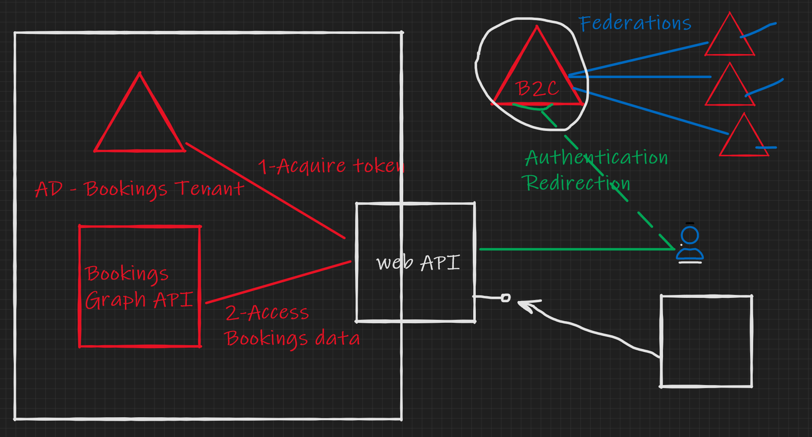

# Microsoft Bookings .NET 5.0 API Samples

This folder contains updated samples for .NET 5.0

1. Microsoft.Bookings.Client
   
   A .NET5 Standard library that can be used from any type of project to access the Bookings Graph API

2. BookingsSampleNativeConsole
   
   The console application rebuild for .NET5. The application interacts with the Bookings API to create an appointment for a staff member.

   If business specified does not exist it creates one, if staff member entered does not exist it will create a new one.

3. Bookings Web
   
   Sample web application proxying the Bookings Application showing how you can allow authentication το your Bookings application from different/external authentication providers.

   

   For this sample to work you will need to provide the following application settings
   
   To connect with the Azure AD of the Office 365 Tenant :

   | Setting name | Setting Value |
   | ------------ | ------------- |
   | Bookings_TenantID | Azure AD Tenant ID |
   | Bookings_ClientID | Azure AD Application registration client ID |
   | Bookings_Username | Username of user that has access to Bookings application. Bookings changes will be made on behalf of this user.|
   | Bookings_Password | Password of user that has access to Bookings application |
   
   To connect with the Azure AD B2C used for the user authentication :
   | Setting name | Setting Value |
   | ------------ | ------------- |
   | Instance | https://**[B2C Tenant Name]**.b2clogin.com |
   | Domain | **[B2C Tenant Name]**.onmicrosoft.com |
   | ClientId | [B2C APPLICATION **CLIENT ID**] |
   | TenantId | [B2C **TENANT ID**] |
   | SignUpSignInPolicyId | [Sign up/sign in policy name] |
   | CallbackPath | /signin-oidc |
   | SignedOutCallbackPath | /signout-callback-oidc"